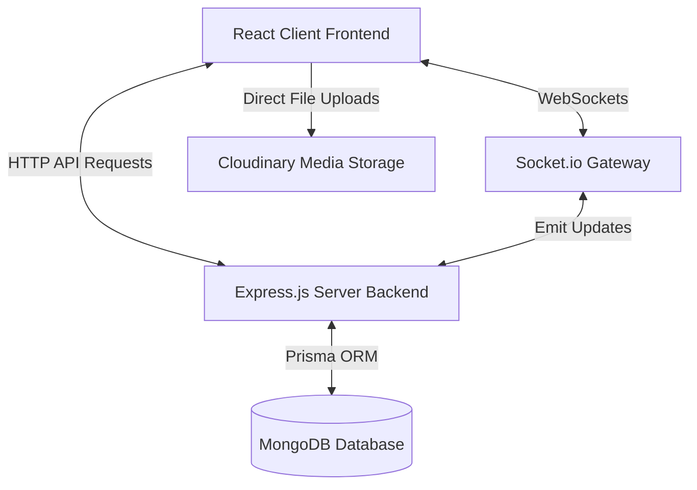

# GoldenKey Estates 🗝️🏡

GoldenKey Estates is a premium, state-of-the-art Real Estate platform. It provides a seamless property search experience with interactive geolocation map pins, a dynamic rich-text listing creator, profile uploads, and real-time Socket.io instant messaging with dynamic unread notification badges.

---

## 🌟 Key Features

### 1. 🔐 Secure Authentication & Authorization
- **Session Security:** Cookie-based JSON Web Tokens (JWT) handling server sessions.
- **Password Safety:** Strong encryption using `bcrypt` salting and hashing.
- **Visual Feedback:** Responsive, animated toast notifications for login, registration, and profile updates powered by `react-hot-toast`.

### 2. ⚡ Real-Time Instant Messaging & Live Notifications
- **WebSocket Gateway:** Real-time communications handled by a dedicated `socket` server using Socket.io.
- **State Synced Chats:** Thread listings that light up yellow and bold with unread items.
- **Badge Synchronization:** Global unread badge counts in the main navigation bar that adjust immediately in real-time as chats open, read, or receive messages.
- **Self-Conversation Prevention:** The single property page automatically detects if you own a listing, disabling the self-chat feature.

### 3. 🔍 Reactive Search & URL-Synchronized Filtering
- **URL Parameter Syncing:** All filter parameters (Location/City, Buy/Rent Type, Property Category, Min/Max Price, Bedrooms) sync directly with the browser URL query string using React Router's `useSearchParams`.
- **Dynamic Re-Fetching:** Modifying any filter automatically prompts the v7 loader to query matched listings from the MongoDB database without page reload or lag.

### 4. 🗺️ Geolocated Leaflet Map Integration
- **Map View:** Premium interactive Leaflet Map that plots custom pins for matching properties.
- **Deferred Streaming:** Displays a skeleton loader and streams map pins concurrently with list cards using React `<Suspense>` and `<Await>`.

### 5. 📸 Cloudinary & Dynamic Uploads
- **On-Demand Script Injection:** Modern `UploadWidget` script injector that activates widgets cleanly on-click.
- **Multi-Image Previews:** A custom listing creator grid preview showing uploaded property pictures in real-time.

### 6. 📝 Rich Property Creator
- **Rich Text Editor:** Built-in React Quill text editor that allows owners to draft fully formatted description summaries.
- **Numeric Schema Parsing:** Ensures nested post metadata inputs (bathroom/bedroom counts, pricing, room sizes) parse into precise integer queries before persisting to MongoDB.

---

## 🛠️ Technology Stack

| Layer | Technologies Used |
| :--- | :--- |
| **Frontend** | React, React Router v7, Sass/SCSS, React Hot Toast, Leaflet (Maps), React Quill, Axios |
| **Backend** | Node.js, Express.js, Prisma ORM, MongoDB, Socket.io, JWT, Cookie Parser, Cors |
| **Storage** | Cloudinary (Media Hosting), MongoDB (Database Persistence) |

---

## 📊 System Architecture



---

## 📂 Project Directory Map

### Frontend Repository Layout (`/projects/GoldenKey-Estates`)
```
├── src
│   ├── components
│   │   ├── card/            # Property Card Components
│   │   ├── chat/            # Live Chat Panel Containers
│   │   ├── filter/          # URL-Synchronized Search Filter Panel
│   │   ├── map/             # Interactive Geolocation Leaflet Pins
│   │   ├── navbar/          # Dynamic Navigation & Notification Badges
│   │   ├── searchBar/       # Home Search Input State Router
│   │   └── uploadWidget/    # On-demand Cloudinary Image Uploads
│   ├── context
│   │   ├── AuthContext.jsx         # Global User Sessions
│   │   ├── NotificationContext.jsx  # Unread Live Chat Badges
│   │   └── SocketContext.jsx       # Global Socket.io Connections
│   ├── lib
│   │   ├── apiRequest.js    # Pre-configured Axios Defaults
│   │   └── loaders.js       # React Router v7 Promise Streamers
│   └── pages
│       ├── newPostPage/     # Quill Rich Editor & Image Grid Listing Form
│       ├── profilePage/     # User Listings & Live Messages Inbox
│       ├── singlePage/      # Detailed Property View & Message Starters
│       └── updateProfilePage/ # Cloudinary Avatar & Form Updates
```

### Backend Repository Layout (`/backend/GoldenKey-Estates`)
```
├── prisma
│   └── schema.prisma        # Prisma Database Schema Definitions
├── socket
│   ├── app.js               # Socket.io Client Mappings & Listeners
│   └── package.json         # Node Watch Execution Scripts
├── src
│   ├── controllers          # Auth, User, Post, Chat & Message Controllers
│   ├── routes               # Express Resource Route Mappings
│   ├── utils                # Custom Prisma Clients & Formatted Handlers
│   └── app.js               # API Server Entrypoint & CORS Settings
```

---

## ⚙️ Configuration & Environment Setup

Create an `.env` file inside both folders to set up core connections.

### Backend Environment Variables (`/backend/GoldenKey-Estates/.env`)
```env
DATABASE_URL="mongodb+srv://<username>:<password>@cluster0.mongodb.net/goldenkey?retryWrites=true&w=majority"
JWT_SECRET="YOUR_SUPER_SECRET_KEY"
CLIENT_URL="http://localhost:5173"
PORT=8800
```

### Socket Gateway Environment (`/backend/GoldenKey-Estates/socket/.env` / fallback defaults)
- Server opens port `4000` to interface with backend routes and client sockets.

### Frontend Credentials Configuration (`UploadWidget.jsx`)
- **Cloud Name:** `dddcijrz6`
- **Upload Preset:** `GoldenKey`

---

## 🚀 Running the Platform

### 1. Launch the Database Sync
Initialize your Prisma Client and push schemas to your MongoDB Atlas cluster:
```bash
# Inside backend directory
npx prisma generate
npx prisma db push
```

### 2. Start the Backend API Server
```bash
# Inside backend directory
npm install
npm start
```
*API runs on `http://localhost:8800/api`*

### 3. Start the WebSockets Server
```bash
# Inside backend/socket directory
npm install
npm run dev
```
*Gateway runs on `http://localhost:4000`*

### 4. Start the Frontend App
```bash
# Inside projects/GoldenKey-Estates directory
npm install
npm run dev
```
*App launches on `http://localhost:5173`*

---

## 📡 API Reference endpoints

### Authentication
- `POST /auth/register` - Create an account.
- `POST /auth/login` - Verify password and set session cookie.
- `POST /auth/logout` - Invalidate session cookie.

### Property Listings
- `GET /posts` - Query matching listings (Supports `city`, `type`, `property`, `minPrice`, `maxPrice`, `bedroom`).
- `GET /posts/:id` - Fetch unique property details, including detailed amenities and owner details.
- `POST /posts` - Create a listing (Requires authentication).
- `DELETE /posts/:id` - Remove listing (Requires ownership, cascade deletes details & saves).

### User Operations
- `PUT /user` - Edit username, email, password, and profile avatar.
- `GET /user/notification` - Retrieve total unread chats count.
- `POST /user/save` - Save/Bookmark a property listing.

### Chats & Messaging
- `GET /chats` - List user chats.
- `POST /chats` - Initialize a chat thread.
- `PUT /chats/read/:id` - Mark chat thread seen/read.
- `POST /messages/:chatId` - Save message inside a thread.

---